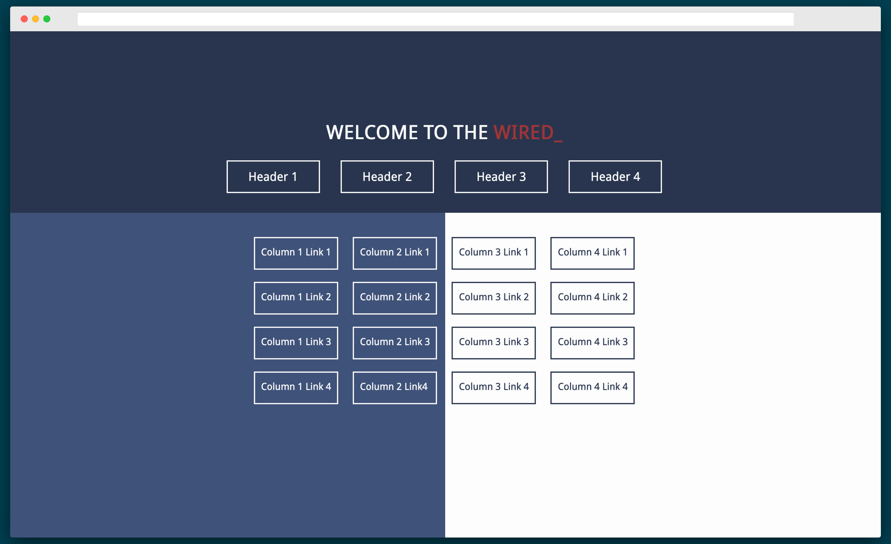

# Startpage

## INDEX

- [Updates](https://github.com/AnthonyVadala/Startpage#updates)
- [Startpage](https://github.com/AnthonyVadala/Startpage#startpage)
- [Links](https://github.com/AnthonyVadala/Startpage#links)
- [Preview](https://github.com/AnthonyVadala/Startpage#preview)
- [Startpage Archive](https://github.com/AnthonyVadala/Startpage#startpage-archive)

## STARTPAGE

This is a complete overhaul of Blue 2.0:
- Less CSS to handle the button effects
- Easier to read HTML
- Examples on how to add websites
- More code annotations
- (ALMOST) Fully compliant HTML5 and CSS3 validation (center is just such a convenient tag)
- More blinking (RIP blink tag)
- (NEW) Added [dark mode support](https://developer.mozilla.org/en-US/docs/Web/CSS/@media/prefers-color-scheme)!

## LINKS

- [Live Preview](http://AnthonyVadala.github.io/Startpage/startpage/index.html)
- [Code](https://github.com/AnthonyVadala/Startpage/tree/master/startpage)

## PREVIEW

## STARTPAGE ARCHIVE

- [Simple Startpage](https://github.com/AnthonyVadala/Startpage/tree/master/archive/simple%20startpage)
- [Kat Startpage](https://github.com/AnthonyVadala/Startpage/tree/master/archive/kat%20startpage)
- [Kat Startpage (No Note)](https://github.com/AnthonyVadala/Startpage/tree/master/archive/kat%20startpage%20(no%20note))
- [Blue v1.0 Startpage](https://github.com/AnthonyVadala/Startpage/tree/master/archive/blue%20v1.0)
- [Blue v2.0 Startpage](https://github.com/AnthonyVadala/Startpage/tree/master/archive/blue%20v2.0)
